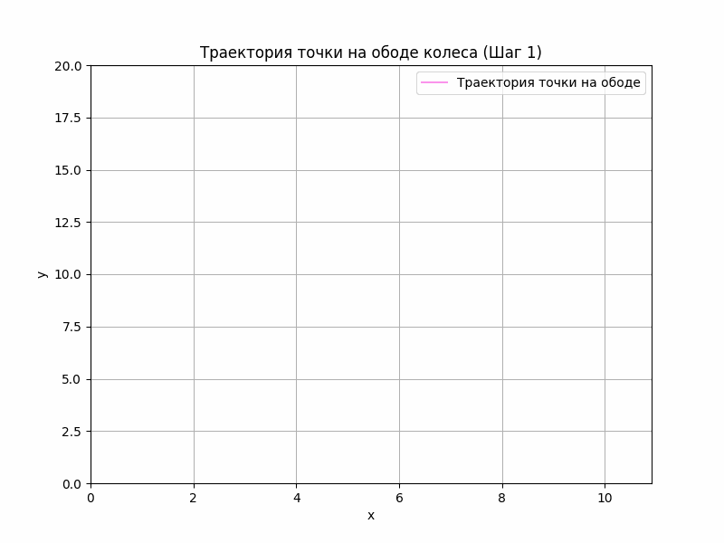

# Задание к лекции №3
>Визуализация движения точки на ободе колеса/диска. Входные параметры:
радиус колеса, скорость центра масс. Итоговый вид модели: траектория
точки на ободе колеса (динамическая модель (преимущественно) или
статическая). Под динамической моделью понимается отрисовка кривой с
течением времени, статическая – график зависимости y(x) – траектория
точки. 

Этот проект создает анимацию траектории точки на ободе катящегося колеса, известной как циклоида. Программа позволяет пользователю вводить радиус колеса и скорость центра масс, после чего генерирует и сохраняет GIF-анимацию траектории.

## Используемые формулы

Траектория точки на ободе катящегося колеса (циклоида) описывается следующими формулами:

$x(t) = Vt - R \sin\left(\frac{Vt}{R}\right)$

$y(t) = R - R \cos\left(\frac{Vt}{R}\right)$

где:
- $R$ — радиус колеса,
- $V$ — скорость центра масс,
- $t$ — время.

## Пример
*Входные данные:*
+ Радиус колеса 10
+ Скорость центра масс 2

*Выходные данные:*

